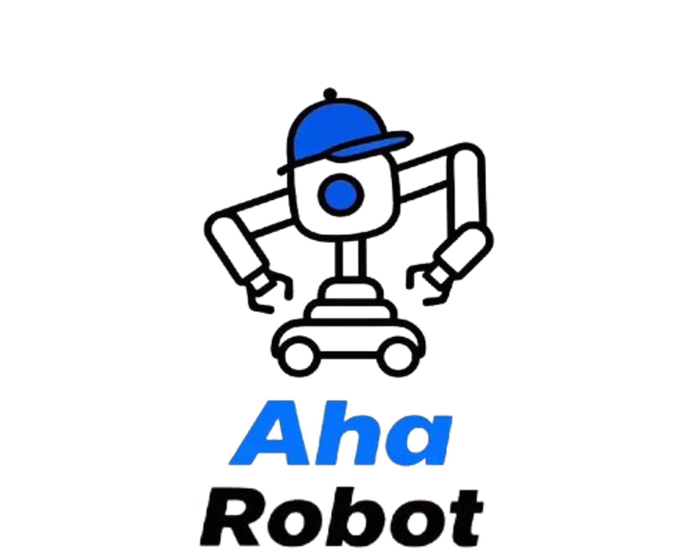

# Firmware Resources

  

  <a href="https://aha-robot-anonymous.github.io/" target="_blank">Project Website</a>

## Repository Contents

This repository contains four submodules of firmware resources, organized as follows:

### Main Components

#### Robot Body Controllers

- **AstraArmController**: Arm controller firmware
  - Controls the arm movements of the Astra robot

- **AstraLiftController**: Lift controller firmware
  - Controls the arm lifting

- **AstraHeadController**: Head controller firmware
  - Controls the robot's head movements

#### Teleoperation Controllers  
- **AstraPedalController**: Firmware for hall-effect pedals
  - Convert the hall-effect analog sensor read to digital form and send it using WebSerial

## How-to-use

For detailed documentation, please refer to our site:

<https://aha-robot-anonymous.github.io/>

## License

This project is licensed under the [GNU General Public License v3.0 (GPL-3.0)](https://www.gnu.org/licenses/gpl-3.0.en.html) with additional restrictions.

This means:
- ✅ You are free to use, modify and distribute the source code
- ✅ You must make your modifications available under the same license
- ✅ You must state changes made to the code
- ✅ You must include the original copyright notice
- ❌ You may not use the material for commercial purposes
- ❌ Modifications must also prohibit commercial use

IMPORTANT: This project explicitly prohibits ANY commercial use, including but not limited to selling products based on this project.

See the [LICENSE](LICENSE) file for the full license text.
